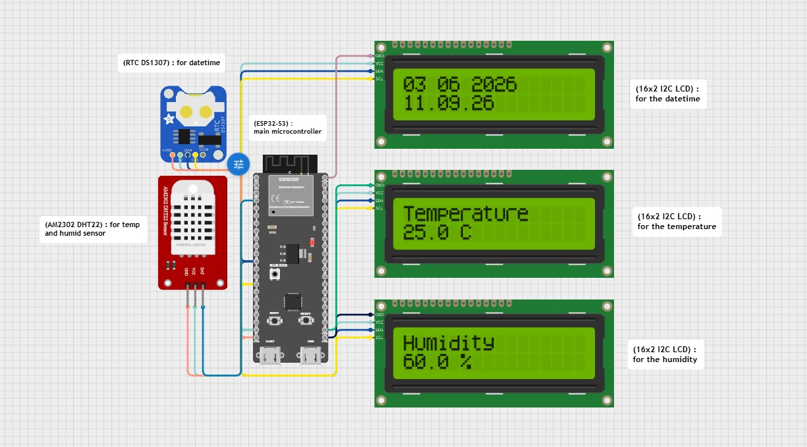

# learn-esp32-temperature-system
#### Currently learning Embedded Systems and IoT
#### Feel free to give advices, criticize, and sharing

<code>circuit_image.png</code>

----------

<code>example.jpeg</code>

----------

# Interactive Embed for the Circuits (from Cirkit Designer IDE)

  <iframe src="https://app.cirkitdesigner.com/project/9331a3ad-e6c7-46e1-b22c-c91adc124685?view=interactive_preview" style="position: absolute; top: 0; left: 0; width: 100%; height: 100%; border: none;"></iframe>

